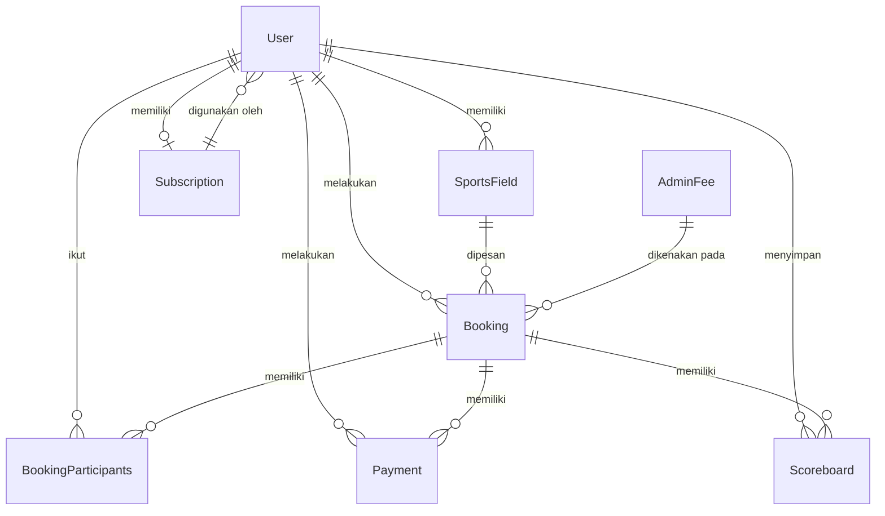

# **Entity Relationship Diagram (ERD): Gsports**

## **1. Deskripsi Umum**

ERD ini dirancang untuk mendukung fungsionalitas utama aplikasi **Gsports**, yaitu:
- Menampilkan **ketersediaan lapangan** tanpa login.  
- Pemesanan lapangan dengan opsi **login wajib** hanya saat akan melakukan booking.  
- Sistem **patungan (split payment)** antar pengguna dalam satu booking.  
- Penambahan **tarif admin** sebagai sumber pendapatan.  
- Fitur **papan skor digital** dengan opsi menyimpan hasil pertandingan.  
- Sistem **freemium** dengan kuota pemakaian gratis dan **subscription premium**.

---

## **2. Entitas dan Atribut**

### **2.1 User**
Menyimpan data pengguna aplikasi (baik free maupun premium).

| Field | Type | Keterangan |
|-------|------|------------|
| user_id | INT (PK) | ID unik pengguna |
| name | VARCHAR | Nama pengguna |
| email | VARCHAR | Email unik pengguna |
| password | VARCHAR | Password terenkripsi |
| phone | VARCHAR | Nomor HP |
| role | ENUM('user','admin','owner') | Jenis pengguna |
| status | ENUM('active','inactive') | Status akun |
| subscription_id | INT (FK) | Relasi ke tabel Subscription |
| quota_remaining | INT | Sisa kuota pemakaian (untuk free user) |
| created_at | DATETIME | Waktu registrasi |
| updated_at | DATETIME | Waktu pembaruan data |

---

### **2.2 SportsField**
Menyimpan data lapangan olahraga yang dapat dipesan.

| Field | Type | Keterangan |
|-------|------|------------|
| field_id | INT (PK) | ID unik lapangan |
| owner_id | INT (FK → User.user_id) | Pemilik lapangan |
| name | VARCHAR | Nama lapangan |
| sport_type | ENUM('badminton','futsal','tennis','basket','voli', ...) | Jenis olahraga |
| location | VARCHAR | Lokasi |
| price_per_hour | DECIMAL | Harga sewa per jam |
| capacity | INT | Jumlah maksimal pemain |
| description | TEXT | Deskripsi lapangan |
| available | BOOLEAN | Status ketersediaan |
| created_at | DATETIME | Waktu dibuat |
| updated_at | DATETIME | Waktu diperbarui |

---

### **2.3 Booking**
Menyimpan data pemesanan lapangan oleh pengguna.

| Field | Type | Keterangan |
|-------|------|------------|
| booking_id | INT (PK) | ID unik booking |
| user_id | INT (FK → User.user_id) | Pengguna yang melakukan booking utama |
| field_id | INT (FK → SportsField.field_id) | Lapangan yang dipesan |
| start_time | DATETIME | Waktu mulai |
| end_time | DATETIME | Waktu selesai |
| total_price | DECIMAL | Harga total sebelum split |
| admin_fee | DECIMAL | Biaya tambahan untuk admin |
| payment_status | ENUM('pending','paid','cancelled') | Status pembayaran |
| patungan_enabled | BOOLEAN | Apakah booking ini patungan |
| created_at | DATETIME | Waktu dibuat |
| updated_at | DATETIME | Waktu diperbarui |

---

### **2.4 BookingParticipants (Patungan)**
Relasi pengguna-pengguna yang ikut dalam satu booking (untuk sistem patungan).

| Field | Type | Keterangan |
|-------|------|------------|
| participant_id | INT (PK) | ID unik peserta booking |
| booking_id | INT (FK → Booking.booking_id) | Booking yang diikuti |
| user_id | INT (FK → User.user_id) | Pengguna yang ikut |
| payment_share | DECIMAL | Bagian pembayaran masing-masing |
| payment_status | ENUM('pending','paid') | Status pembayaran peserta |
| joined_at | DATETIME | Waktu bergabung |

---

### **2.5 Payment**
Menyimpan detail transaksi pembayaran pengguna.

| Field | Type | Keterangan |
|-------|------|------------|
| payment_id | INT (PK) | ID unik pembayaran |
| booking_id | INT (FK → Booking.booking_id) | Booking terkait |
| user_id | INT (FK → User.user_id) | Pengguna yang melakukan pembayaran |
| amount | DECIMAL | Jumlah nominal dibayar |
| method | ENUM('wallet','bank_transfer','ewallet') | Metode pembayaran |
| status | ENUM('pending','success','failed') | Status pembayaran |
| created_at | DATETIME | Waktu pembayaran dilakukan |

---

### **2.6 Scoreboard**
Menyimpan data hasil pertandingan untuk fitur papan skor digital.

| Field | Type | Keterangan |
|-------|------|------------|
| score_id | INT (PK) | ID unik skor |
| booking_id | INT (FK → Booking.booking_id) | Booking terkait |
| team_a_name | VARCHAR | Nama tim A |
| team_b_name | VARCHAR | Nama tim B |
| score_team_a | INT | Skor tim A |
| score_team_b | INT | Skor tim B |
| saved_by | INT (FK → User.user_id) | Pengguna yang menyimpan skor |
| created_at | DATETIME | Waktu pembuatan |
| updated_at | DATETIME | Waktu pembaruan |

---

### **2.7 Subscription**
Menyimpan data jenis langganan (premium plan).

| Field | Type | Keterangan |
|-------|------|------------|
| subscription_id | INT (PK) | ID unik subscription |
| name | VARCHAR | Nama paket (misal: Free, Premium, Pro) |
| price | DECIMAL | Harga langganan |
| quota_limit | INT | Batas kuota pemakaian |
| sport_access_limit | INT | Batas cabang olahraga |
| duration_days | INT | Durasi berlangganan (hari) |
| created_at | DATETIME | Waktu dibuat |
| updated_at | DATETIME | Waktu diperbarui |

---

### **2.8 AdminFee**
Menyimpan pengaturan biaya tambahan admin.

| Field | Type | Keterangan |
|-------|------|------------|
| fee_id | INT (PK) | ID unik biaya admin |
| percentage | DECIMAL | Persentase biaya admin |
| description | TEXT | Keterangan tambahan |
| active | BOOLEAN | Status aktif/tidak |
| created_at | DATETIME | Waktu dibuat |

---

## **3. Relasi Antar Entitas**

