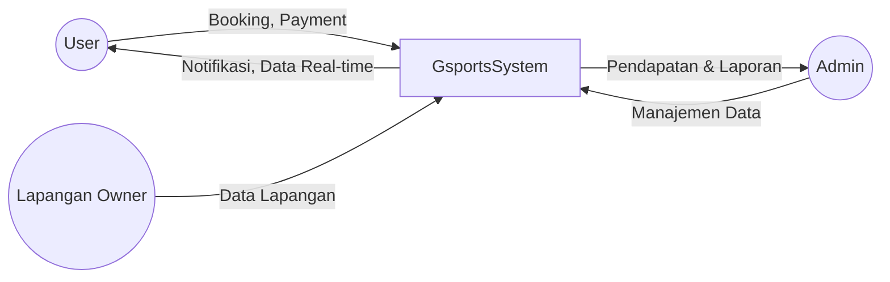

# **Software Requirements Specification (SRS): Gsports v1.0**

---

## **1. Informasi Umum**

- **Nama Aplikasi:** Gsports  
- **Versi Dokumen:** 1.0  
- **Tanggal:** 5 November 2025  
- **Penulis:**
  - Ahmad Rois (221240001239)
  - M. Gilang M.W. Sabdokafi (221240001248)

---

## **2. Pendahuluan**

### **2.1 Tujuan**
Dokumen ini bertujuan untuk menjelaskan kebutuhan perangkat lunak dari aplikasi **Gsports**, yaitu sistem pemesanan dan manajemen lapangan olahraga dengan integrasi papan skor digital serta sistem langganan premium.

Aplikasi ini dirancang untuk memberikan kemudahan bagi pengguna dalam:
- Melihat ketersediaan lapangan olahraga tanpa login.
- Melakukan pemesanan lapangan dengan sistem pembayaran patungan.
- Mengelola hasil pertandingan dengan papan skor digital.
- Mengakses fitur premium berbasis subscription.

---

### **2.2 Ruang Lingkup (Scope)**
Aplikasi **Gsports** merupakan platform multi-olahraga yang memungkinkan pengguna:
- Melihat daftar dan ketersediaan lapangan olahraga secara real-time.
- Melakukan pemesanan dan pembayaran (individu maupun patungan).
- Menggunakan papan skor untuk mencatat hasil pertandingan.
- Menyimpan hasil pertandingan dalam profil pengguna.
- Mengakses fitur premium untuk membuka cabang olahraga tambahan dan kuota pemakaian lebih besar.

Stakeholder utama:
- **User:** Pengguna aplikasi (pemain olahraga).
- **Owner:** Pemilik lapangan olahraga.
- **Admin:** Pengelola sistem dan data aplikasi.

---

### **2.3 Definisi dan Singkatan**

| Singkatan | Definisi |
|------------|-----------|
| DB | Database |
| UI | User Interface |
| API | Application Programming Interface |
| CRUD | Create, Read, Update, Delete |
| MVP | Minimum Viable Product |
| FK | Foreign Key |
| PK | Primary Key |

---

## **3. Deskripsi Umum Sistem**

### **3.1 Perspektif Produk**

Aplikasi Gsports menggabungkan tiga komponen utama:
1. **Frontend (Mobile/Web App):**
   - Dibangun menggunakan Flutter.
   - Menampilkan UI untuk pengguna dan pemilik lapangan.
2. **Backend API Server:**
   - Menggunakan Node.js atau Laravel sebagai REST API.
   - Terhubung ke database utama (MySQL atau PostgreSQL).
3. **Local Database (Offline Mode):**
   - Menggunakan Drift (SQLite) untuk penyimpanan offline.
   - Sinkronisasi otomatis saat koneksi internet aktif.

---

### **3.2 Fungsi Sistem**

| No | Fungsi Utama | Deskripsi |
|----|---------------|-----------|
| 1 | Lihat Ketersediaan Lapangan | Pengguna dapat melihat daftar lapangan tanpa login |
| 2 | Login dan Register | Pengguna wajib login untuk melakukan pemesanan |
| 3 | Pemesanan Lapangan | Melakukan booking dan pembayaran lapangan |
| 4 | Sistem Patungan | Beberapa pengguna dapat berbagi biaya satu booking |
| 5 | Pembayaran Online | Mendukung e-wallet, transfer, dan split payment |
| 6 | Papan Skor | Mencatat skor pertandingan dan menyimpannya ke akun pengguna |
| 7 | Sistem Freemium | Batas kuota untuk pengguna baru dan opsi upgrade ke premium |
| 8 | Admin Fee | Setiap booking dikenai biaya tambahan untuk admin |
| 9 | Sinkronisasi Data | Menyinkronkan data lokal ke server pusat (Drift ↔ Cloud) |

---

### **3.3 Diagram Konteks Sistem**


---
# 3.4 Karakteristik Pengguna
| Jenis Pengguna | Deskripsi             | Akses Fitur                               |
| -------------- | --------------------- | ----------------------------------------- |
| Guest          | Pengguna tanpa login  | Lihat daftar lapangan dan ketersediaannya |
| User           | Pengguna login        | Booking, skor pertandingan, patungan      |
| Premium User   | Pengguna berlangganan | Fitur penuh & cabang olahraga tambahan    |
| Owner          | Pemilik lapangan      | Mengelola data lapangan dan jadwal        |
| Admin          | Pengelola sistem      | Manajemen pengguna, laporan, verifikasi   |
---
# 3.5 Batasan Sistem
- Aplikasi harus tetap dapat diakses dalam mode offline (melalui Drift).
- Sinkronisasi hanya berjalan ketika koneksi stabil.
- Pengguna wajib login sebelum melakukan transaksi.
- Satu booking hanya dapat memiliki maksimal jumlah pemain sesuai kapasitas lapangan.
---
# 4. Kebutuhan Fungsional

## 4.1 Modul Autentikasi
- Pengguna dapat melakukan login dan register.
- Login menggunakan email dan password.
- Enkripsi password menggunakan bcrypt.
- Verifikasi akun dilakukan melalui email.

## 4.2 Modul Lapangan
- Pengguna dapat melihat daftar lapangan tanpa login.
- Owner dapat menambahkan, mengubah, dan menghapus data lapangan.
- Admin dapat memverifikasi data lapangan.

## 4.3 Modul Pemesanan
- Pengguna login dapat membuat pemesanan.
- Booking memiliki status: `pending`, `paid`, `cancelled`.
- Sistem menghitung total harga + admin fee.
- Jika patungan aktif, sistem akan membagi harga ke setiap peserta.

## 4.4 Modul Patungan
- Booking dapat diaktifkan sebagai patungan.
- Pengguna lain dapat bergabung dengan kode booking.
- Sistem menghitung dan menampilkan proporsi pembayaran setiap peserta.

## 4.5 Modul Pembayaran
- Mendukung metode pembayaran: e-wallet, bank transfer, saldo akun.
- Konfirmasi otomatis dari gateway pembayaran.
- Status pembayaran diperbarui secara real-time.

## 4.6 Modul Scoreboard
- Pengguna dapat mencatat skor pertandingan.
- Skor disimpan ke dalam database dan dapat diakses kembali.
- Opsi untuk membagikan hasil ke media sosial atau rekap pribadi.

## 4.7 Modul Subscription & Freemium
- Setiap pengguna baru memiliki 5 kuota gratis.
- Kuota berkurang setiap kali booking selesai.
- Pengguna dapat membeli paket premium untuk menambah kuota dan akses cabang olahraga lain.

## 4.8 Modul Admin
- Melihat seluruh transaksi.
- Mengatur tarif admin fee.
- Melihat statistik penggunaan dan laporan keuangan.
---
# 5. Kebutuhan Non-Fungsional
| Aspek            | Deskripsi                                             |
| ---------------- | ----------------------------------------------------- |
| **Keamanan**     | Semua data sensitif (password, transaksi) dienkripsi. |
| **Kinerja**      | Aplikasi mampu menampilkan data lapangan < 3 detik.   |
| **Ketersediaan** | Minimal uptime server 99%.                            |
| **Portabilitas** | Dapat dijalankan di Android, iOS, dan web.            |
| **Usability**    | Antarmuka intuitif dengan desain responsif.           |
| **Reliability**  | Sinkronisasi otomatis ketika koneksi kembali aktif.   |
---
# 6. Arsitektur Sistem
```mermaid
graph TD

subgraph Client
    A1[Flutter App]
    A2[Local DB (Drift)]
end

subgraph Backend
    B1[API Gateway]
    B2[Business Logic Service]
    B3[Payment Service]
end

subgraph Database
    C1[(MySQL Cloud)]
    C2[(Drift Local)]
end

A1 --> A2
A1 -->|REST API| B1
B1 --> B2
B1 --> B3
B2 --> C1
C1 -->|Sync Data| C2

```

# Penjelasan Komponen Sistem

## 1. Flutter App
- Merupakan antarmuka utama pengguna untuk platform **mobile** dan **web**.
- Menyediakan akses ke fitur-fitur seperti autentikasi, pemesanan, scoreboard, dan subscription.

## 2. Drift
- Digunakan sebagai **penyimpanan lokal** pada perangkat pengguna.
- Mendukung **mode offline**, memungkinkan pengguna tetap mengakses data meskipun tidak terhubung ke internet.

## 3. API Gateway
- Berfungsi sebagai **penghubung antara frontend dan backend**.
- Menyediakan endpoint terpusat untuk komunikasi data dan otorisasi permintaan.

## 4. Business Logic Service
- Menangani seluruh **logika bisnis** aplikasi, termasuk:
  - Proses pemesanan lapangan
  - Fitur patungan
  - Manajemen kuota dan subscription

## 5. Payment Service
- Mengelola integrasi dengan **layanan pembayaran eksternal** seperti:
  - Midtrans
  - Xendit
- Mendukung konfirmasi otomatis dan pembaruan status pembayaran secara real-time.

## 6. MySQL Cloud
- Menjadi **database utama** yang menyimpan seluruh data sistem.
- Menyimpan data pengguna, lapangan, transaksi, skor, dan subscription secara terpusat di server cloud.
---
# 7. Diagram Use Case
```mermaid
usecaseDiagram
actor "Guest" as G
actor "User" as U
actor "Owner" as O
actor "Admin" as A

G --> (Lihat Daftar Lapangan)
U --> (Login / Register)
U --> (Booking Lapangan)
U --> (Patungan)
U --> (Pembayaran)
U --> (Gunakan Scoreboard)
U --> (Upgrade ke Premium)
O --> (Kelola Lapangan)
A --> (Atur Admin Fee)
A --> (Kelola Pengguna & Laporan)
```
---
Berikut adalah penulisan ulang bagian Kebutuhan Basis Data dalam format Markdown yang rapi dan terstruktur:
# 8. Kebutuhan Basis Data

Aplikasi menggunakan dua jenis basis data untuk mendukung sinkronisasi dan performa:

## 1. MySQL (Server)
- Digunakan sebagai **database utama** yang berjalan di cloud/server.
- Menyimpan data terpusat untuk seluruh modul aplikasi.
- Mendukung integrasi dengan layanan backend dan API Gateway.

## 2. Drift (Local)
- Digunakan sebagai **penyimpanan lokal** pada perangkat pengguna.
- Mendukung **mode offline** dan sinkronisasi data saat koneksi tersedia.
- Cocok untuk caching data seperti daftar lapangan, skor, dan histori booking.

## 3. Skema Tabel (ERD Gsports.md)
Struktur basis data dijelaskan dalam dokumen ERD `Gsports.md`, yang mencakup tabel-tabel berikut:

- `User` – Menyimpan data akun pengguna, termasuk autentikasi dan subscription.
- `SportsField` – Informasi lapangan olahraga yang tersedia untuk booking.
- `Booking` – Data pemesanan lapangan, status, waktu, dan total harga.
- `BookingParticipants` – Daftar peserta dalam satu booking, termasuk proporsi pembayaran.
- `Payment` – Informasi transaksi pembayaran dan statusnya.
- `Scoreboard` – Catatan skor pertandingan yang dapat diakses kembali.
- `Subscription` – Data kuota gratis dan paket premium pengguna.
- `AdminFee` – Pengaturan tarif biaya admin yang digunakan dalam perhitungan total harga.
---
# 9. Lampiran

## 9.1 Teknologi yang Digunakan

- **Frontend**: Flutter  
- **Backend**: Node.js / Laravel  
- **Database Server**: MySQL / PostgreSQL  
- **Local Database**: Drift (SQLite)  
- **Hosting**: AWS / Railway  
- **Payment Gateway**: Midtrans / Xendit  
- **Auth & Notification**: Firebase
