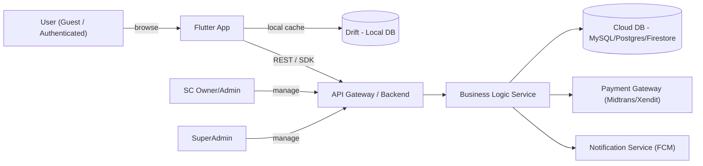
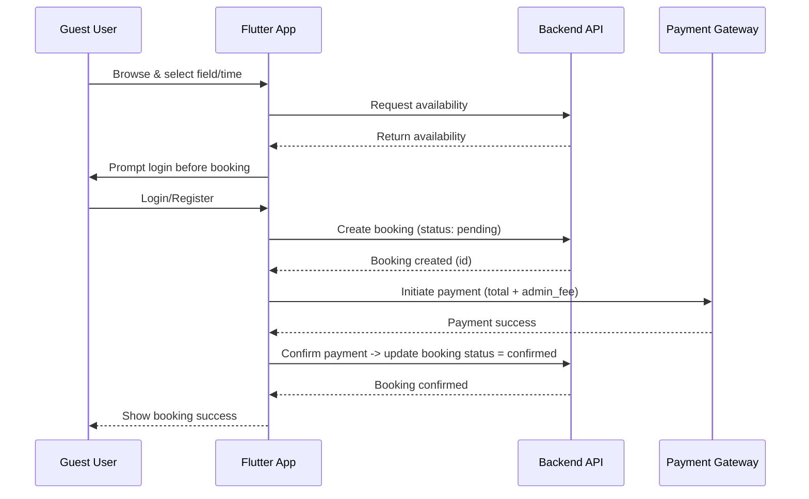
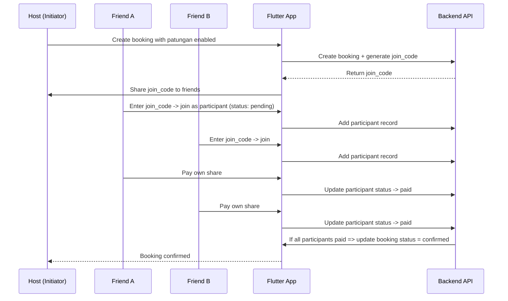
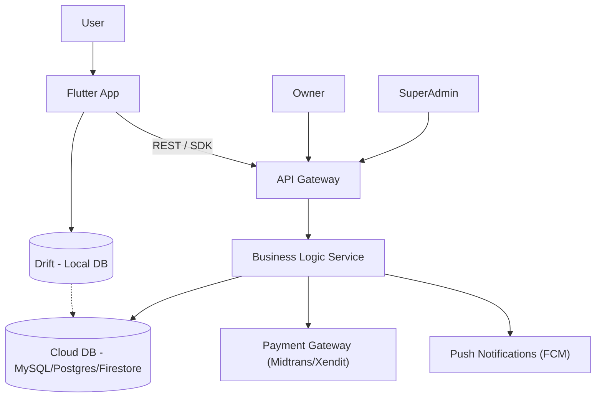

# **Software Requirements Specification (SRS)**  
## **Aplikasi Gsports v1.0**

---

### **1. Informasi Umum**
- **Nama Aplikasi:** Gsports  
- **Versi Dokumen:** 1.0  
- **Tanggal:** 5 November 2025  
- **Anggota Tim:**
  - Ahmad Rois (221240001239)
  - M. Gilang M.W. Sabdokafi (221240001248)
---

## 1. Ruang Lingkup
Aplikasi Gsports menyediakan:
- Penelusuran dan tampilan ketersediaan lapangan (tanpa login).  
- Pemesanan lapangan (login wajib) — opsi individu atau patungan (split payment).  
- Perhitungan tarif + admin fee.  
- Papan skor digital (disimpan lokal kalau guest, disimpan cloud kalau login).  
- Model freemium: pengguna baru mendapat 5 kuota booking dan akses 5 cabang olahraga; akses penuh via subscription premium.  
- Sinkronisasi offline ↔ cloud (local DB + cloud DB).

---

## 2. Stakeholder Utama
- **Pengguna (Player):** Mencari & memesan lapangan, ikut patungan, pakai scoreboard.  
- **Owner / Admin Sport Center (SC Admin):** Mengelola lapangan, konfirmasi booking, melihat transaksi.  
- **Platform Admin (Super Admin):** Mengelola tenant, laporan, pengaturan admin fee.  
- **Tim Pengembang / QA / DevOps.**  
- **Penyedia Pembayaran (Midtrans/Xendit atau sejenis).**

---

## 3. Definisi & Akronim
- **API:** Application Programming Interface  
- **DB:** Database  
- **Drift:** Local SQLite DB untuk Flutter (offline cache)  
- **FCM:** Firebase Cloud Messaging  
- **MVP:** Minimum Viable Product  
- **SC:** Sports Center  
- **SDK:** Software Development Kit  
- **UI:** User Interface  
- **UX:** User Experience

---

## 4. Perspektif Produk
Gsports adalah aplikasi mobile-first (Flutter) dengan backend terpusat. Aplikasi mendukung mode guest (lihat data publik tanpa akun) dan mode authenticated (booking, menyimpan skor, subscription). Arsitektur bersifat offline-first: data sering dicache di lokal (Drift) dan disinkronisasikan ke cloud DB (MySQL/Postgres/Firestore) ketika koneksi tersedia. Logika bisnis kritikal (konflik booking, split payment validation, quota check) dijalankan di backend (serverless functions atau service).

---

## 5. Diagram Konteks Sistem
Gunakan diagram sederhana agar mermaid parser tidak error. (Flowchart dasar)


---
## 6. Fungsi Utama
| ID    | Nama Fungsi                    | Ringkasan / Acceptance Criteria                                                              |
| ----- | ------------------------------ | -------------------------------------------------------------------------------------------- |
| F-001 | Browse Lapangan (Guest)        | User dapat melihat daftar SC & lapangan tanpa login; hasil memuat < 3s.                      |
| F-002 | Detail Lapangan                | Menampilkan foto, harga, kapasitas, jam operasional, jadwal availabilitas.                   |
| F-003 | Register / Login               | Register & Login via Email/Password, Google OAuth; password disimpan hashed.                 |
| F-004 | Create Booking                 | User (auth) dapat membuat booking: pilih lapangan, tanggal, jam; booking disimpan (pending). |
| F-005 | Patungan (Split Booking)       | Pemesan dapat buat patungan dengan `join_code`; peserta bergabung; share dihitung otomatis.  |
| F-006 | Payment Processing             | Integrasi payment gateway; konfirmasi pembayaran mengubah booking -> paid/confirmed.         |
| F-007 | Admin Fee Calculation          | Sistem menambahkan admin_fee (mis. 5%) pada total; net_amount dihitung.                      |
| F-008 | Scoreboard                     | Papan skor interaktif per match; simpan ke riwayat (lokal jika guest, cloud jika auth).      |
| F-009 | Riwayat Pertandingan & Booking | User dapat melihat riwayat booking & matches.                                                |
| F-010 | Subscription & Quota           | New user auto free-plan (quota=5, sport_limit=5); check quota sebelum booking.               |
| F-011 | SC Management                  | SC Admin CRUD lapangan, blokir slot, konfirmasi payment manual.                              |
| F-012 | Reporting & Admin Tools        | Super Admin lihat revenue, admin_fee totals, manage plans.                                   |
---
### 7. Karakteristik Pengguna

- **Technical level**: Non-technical (casual users). UI harus simpel.
- **Devices**: Android + iOS (minimum Android 6.0, iOS 12 recommended).
- **Connectivity**: Mix online/offline; offline read + deferred write/sync.

### 8. Batasan

- Booking finalization (confirmation) memerlukan koneksi untuk pembayaran.
- Drift local cache hanya untuk UX & offline; authoritative data on cloud DB.
- Split payment support tergantung pada kemampuan payment gateway untuk partial payments (jika gateway tidak mendukung, gunakan mekanisme internal: participants pay individually to platform account).
- Notifikasi push menggunakan FCM.

### 9. Kebutuhan Non-Fungsional

- **Keamanan**: TLS 1.2+, JWT/OAuth 2.0, password hashing (bcrypt).
- **Performance**: API response ≤ 1s for single-item fetch; list queries ≤ 2s.
- **Scalability**: Rancang service stateless + DB skalabel.
- **Reliability**: Offline capability via Drift; conflict resolution by latest updated_at.
- **Maintainability**: Modular code, documented OpenAPI/Swagger.
- **Accessibility**: Tap targets ≥ 44x44 dp; color contrast WCAG AA.
---
## 10. Alur Pemesanan Lapangan

---
## 11. Alur Pembayaran Split-payment (Patungan)

---
## 12. Arsitektur Sistem

### Komponen Utama & Fungsi Singkat

- **Flutter App**: UI, local cache (Drift), offline-first UX.
- **Drift (Local DB)**: Cache ketersediaan, pending bookings, temporary matches.
- **API Gateway**: Auth, rate-limiting, routing.
- **Business Logic Service**: Booking validation, patungan logic, quota enforcement, admin fee calc, sync.  
  *(dapat berupa Appwrite Functions / serverless / Node/Laravel service)*
- **Cloud DB**: Single source of truth.
- **Payment Gateway**: Menangani transaksi.
- **FCM**: For push notifications.
---
## 13. Use Case Diagram
```mermaid
graph LR
    U[User] -->|browse| View["Browse Fields"]
    U -->|auth| Auth["Login/Register"]
    U -->|book| Book["Create Booking"]
    U -->|join| Join["Join Patungan"]
    U -->|score| Score["Use Scoreboard"]
    U -->|upgrade| Sub["Subscribe Premium"]
    Owner["SC Owner"] -->|manage| Manage["Manage Fields"]
    Admin -->|report| Report["View Reports"]
````
---
### 14. Teknologi yang Digunakan

- **Frontend**: Flutter (Dart 3.x)
- **State management**: Riverpod (direkomendasikan) atau Bloc
- **Local DB**: Drift (moor) atau Hive (alternatif)
- **HTTP**: dio atau http
- **Appwrite SDK**: (opsional) jika gunakan Appwrite backend
- **Backend**: Pilih salah satu:
  - Node.js (Express / NestJS) + TypeScript
  - Laravel (PHP)
  - Appwrite (BaaS) dengan Functions jika ingin menghindari infra heavy
- **Database Cloud**:
  - MySQL 8 / PostgreSQL (relational recommended for transactions)
  - Firestore (NoSQL) jika pilih serverless cepat
- **Payment Gateway**: Midtrans / Xendit (Indonesia) — dukung transfer, e-wallet, callback webhook
- **Push Notifications**: Firebase Cloud Messaging (FCM)
- **Auth**: Firebase Auth or custom JWT with OAuth support (Google)
- **Hosting / Infra**: AWS / GCP / Railway / Vercel (API), managed MySQL (RDS / Cloud SQL)
- **CI/CD**: GitHub Actions / GitLab CI
- **Monitoring & Logging**: Sentry (crash), Prometheus/Grafana or Cloud Monitoring

---

### 15. Database & Integrasi (Skema singkat + Collections/Tables)

**Tabel/Collection utama (relasional style)**

- **users**  
  `id (PK), name, email, phone, password_hash, role, is_premium, quota_remaining, created_at, updated_at`

- **sport_centers**  
  `id, name, address, city, contact, status, created_at, updated_at`

- **fields**  
  `id, center_id (FK), name, sport_type, price_per_hour, capacity, photos, is_active`

- **bookings**  
  `id, field_id, initiator_user_id, start_time, end_time, total_price, admin_fee, net_amount, status, join_code, created_at`

- **booking_participants**  
  `id, booking_id, user_id, share_amount, payment_status, joined_at`

- **payments**  
  `id, booking_id, payer_user_id, amount, method, gateway_txn_id, status, created_at`

- **scoreboards**  
  `id, booking_id, saved_by_user_id, team_a, team_b, score_a, score_b, created_at`

- **subscriptions**  
  `id, user_id, plan_type, start_at, end_at, status`

- **admin_revenue**  
  `id, booking_id, amount, date`

**Sinkronisasi Offline ↔ Cloud**

- Local (Drift) tables mirror a subset of cloud tables:  
  `fields_cache, pending_bookings, pending_participants, local_scores`

**Sync process**:

- Push pending local changes to API when online.
- Pull latest cloud updates to local (delta by `updated_at`).
- Conflict resolution: `last-write-wins` atau merge rules untuk bookings (server-side protection for double-booking).

---

### 16. Rencana Pengujian

- **Unit Tests**: Business logic (quota, split calc, admin fee)
- **Integration Tests**: API ↔ DB ↔ Payment Webhook
- **E2E Tests**: Flutter flows (browse → book → pay)
- **Load Tests**: Simulate concurrent bookings for same field/time to ensure booking locking
- **UAT**: Real users testing in pilot SCs
- **Security Tests**: Penetration (auth, injections), storage encryption checks

---

### 17. Lampiran / Catatan Desain

- **Booking Atomicity**: Use DB transactions or optimistic locking to avoid double booking
- **Join Code**: Random short token (6–8 chars) with expiry (e.g., 30 minutes)
- **Admin Fee Policy**: Configurable percentage; platform keeps `admin_fee`, remainder to SC
- **Quota Enforcement**: Check subscription & `quota_remaining` at server side prior to booking creation
- **Scoreboard Offline Mode**: Save to Drift; allow user to sync later; show sync status in UI

